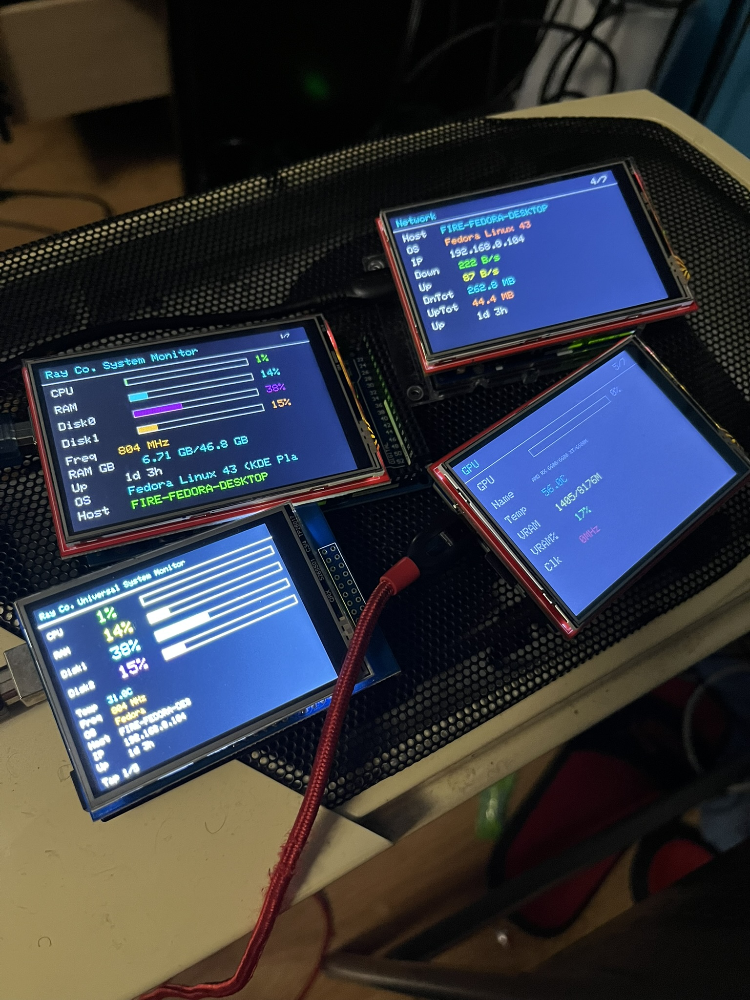
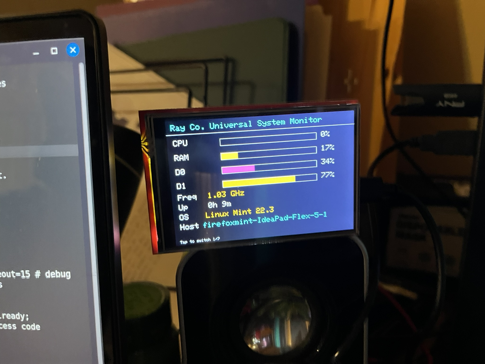
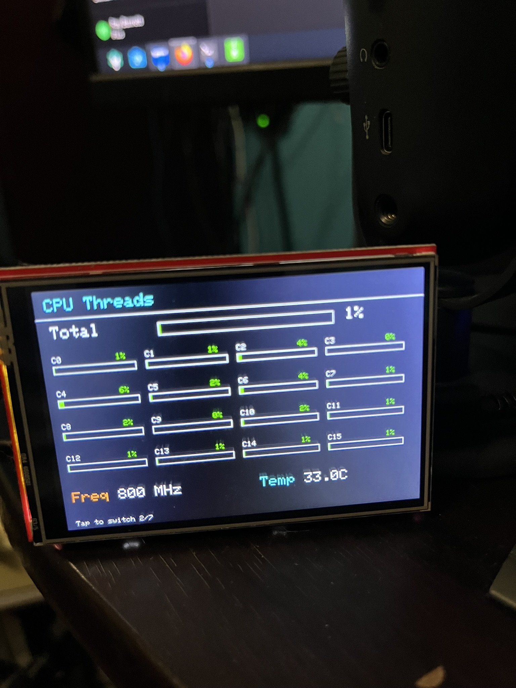
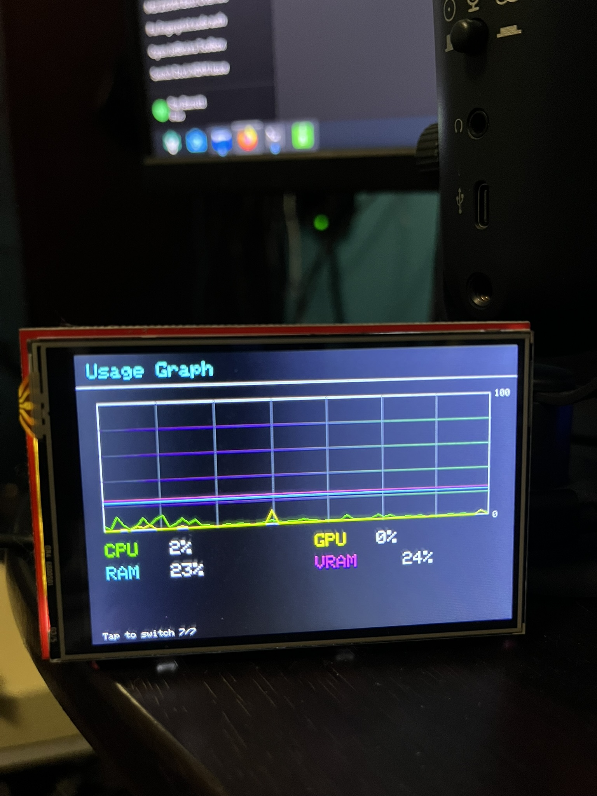

# Ray Co. Arduino Desktop System Monitor

Displays real-time PC hardware statistics on an Arduino touchscreen using a Linux Python monitor plus Arduino firmware and a Java Control Center.

**Author:** Ray Barrett
**Version:** v9.5.3
**Last Modified:** March 23, 2026

---

## Project Status

This project is **built and tested on Linux** and is where active development happens.

- Primary target: **Linux desktops**
- Confirmed working distro family: **Fedora KDE** and **Linux Mint / Ubuntu-style systems**
- **Windows support is legacy only**: some old Windows files are still included in the repository, but Windows is **not a current priority** and should be treated as experimental / unsupported for now.

---

## What v9.5.3 Includes

Release **v9.5.3** adds the readability-focused page layout refresh: the Mega and R3 2.8-inch flows now use full-screen tap paging, Mega / R3 GPU and network views are separated for easier reading, the 2.8-inch storage and power details are split onto dedicated pages, and the R4 usage graph footer now shows hostname plus uptime.

### Major highlights

- **Wi-Fi pairing and persistence** for Arduino UNO R4 WiFi boards
- **Reset Wi-Fi pairing** from the Control Center without reflashing
- **Simultaneous USB + Wi-Fi monitor output** support
- **Unified Wi-Fi TCP port persistence** across monitor config, Control Center, and flashed R4 settings
- **Flash preview improvements** and safer flashing script organization
- **Automatic Arduino dependency installation** before R4 WiFi reflashing
- **UNO R3 mode selection** and better R3 flashing defaults
- **Per-board display rotation controls** with persistence fixes
- **Layered default/shared/local config support** for easier per-computer overrides
- **Repo cleanup** around duplicate monitor/sketch copies and path handling

---

## Preview

### Main views
<p align="center">
  
  
</p>

### Detail pages
<p align="center">
  
  
  
  
  
  
  
  
</p>

---

## Supported Hardware

### Recommended board targets
- **Arduino UNO R4 WiFi + 3.5" TFT display**
- **Arduino Mega 2560 R3 + 2.8" MCUFRIEND TFT display**
- **Arduino Mega 2560 R3 + 3.5" TFT display**
- **Arduino UNO R3 + 2.8" TFT display**

### GPU detection on Linux
- NVIDIA via `nvidia-smi`
- AMD via DRM/sysfs
- Intel via DRM/sysfs / Intel tooling

Behavior can still vary depending on your distro, driver stack, and permissions.

---

## Repository Layout

```text
ArduinoUniversalSystemMonitor/
├── UniversalArduinoMonitor.py                 # Main Linux desktop monitor sender
├── config/
│   ├── monitor_config.default.json            # Tracked baseline defaults
│   ├── monitor_config.json                    # Shared runtime config
│   └── monitor_config.local.json              # Machine-local overrides (git-ignored)
├── requirements.txt                           # Python dependencies
├── install.sh                                 # Main Linux installer
├── arduino_install.sh                         # Stable wrapper for flashing workflow
├── install_arduinos.sh                        # Arduino CLI setup + compile/flash flow
├── update.sh                                  # Update helper
├── uninstall_monitor.sh                       # Uninstall helper
├── UniversalMonitorControlCenter.sh           # Root-level Java GUI launcher
├── install_control_center_desktop.sh          # Optional desktop launcher installer
├── scripts/                                   # Implementation shell scripts
├── R3_MonitorScreen28/                        # Arduino UNO R3 2.8" TFT sketch
├── R3_MonitorScreen35/                        # Arduino UNO R3 3.5" TFT sketch / placeholder
├── R3_MEGA_MonitorScreen28/                   # Arduino Mega 2560 R3 2.8" MCUFRIEND TFT sketch
├── R3_MEGA_MonitorScreen35/                   # Arduino Mega 2560 R3 3.5" TFT sketch
├── R4_WIFI35/                                 # Canonical Arduino UNO R4 WiFi sketch
├── backups/                                   # Backup copies of earlier monitor/config files
├── debug_tools/FakeArduinoDisplay/            # Java fake display + Control Center
├── legacy/Windows/                            # Legacy Windows-side files kept for reference
└── screenshots/                               # README preview images
```

The root shell scripts are kept as stable user-facing entrypoints so the commands stay short, while most implementation logic lives under `scripts/`.

---

## Requirements

### Linux host
- Python **3.8+**
- `git`
- Java **OpenJDK 21** for builds
- Java **OpenJDK 25** for the current Control Center launcher/runtime path
- Arduino IDE **1.8.19+** or Arduino CLI workflow

### Arduino support
- **Option A:** UNO R4 WiFi + 3.5" TFT
- **Option B:** Mega 2560 R3 + 2.8" MCUFRIEND TFT or 3.5" TFT
- **Option C:** UNO R3 + 2.8" TFT

---

## Quick Start

### 1) Install `git`

#### Ubuntu / Linux Mint / Debian
```bash
sudo apt update
sudo apt install -y git
```

#### Fedora
```bash
sudo dnf install -y git
```

#### Arch
```bash
sudo pacman -Sy --noconfirm git
```

### 2) Clone and run the installer

```bash
git clone https://github.com/Firefoxray/ArduinoUniversalSystemMonitor.git
cd ArduinoUniversalSystemMonitor
chmod +x install.sh
./install.sh
```

One-line version:

```bash
git clone https://github.com/Firefoxray/ArduinoUniversalSystemMonitor.git && cd ArduinoUniversalSystemMonitor && chmod +x install.sh && ./install.sh
```

### What `install.sh` does

- Installs required Linux packages
- Installs Python dependencies
- Writes the monitor config files
- Creates the machine-local override file
- Writes and enables the systemd service
- Prompts to install/flash supported Arduino boards

During install you will be asked:

```text
Would you like to install and flash your Arduino(s) now? [y/N]:
```

If you answer `y`, the installer runs `./arduino_install.sh`, which calls `install_arduinos.sh`.

---

## Flashing Workflow

The built-in Arduino flasher now handles much more automatically than older releases.

### It will:
- Install `arduino-cli` if needed
- Install required board cores
- Install required libraries and dependencies
- Compile sketches before upload
- Detect supported connected boards
- Stop the monitor service before flashing and restart it afterward
- Auto-install missing Arduino dependencies before R4 WiFi reflashing
- Retry certain transient upload failures automatically

### UNO R3 behavior
- With **one detected UNO R3**, flashing defaults to the **3.5" sketch**
- With **multiple UNO R3 boards**, the flasher asks which screen size to use
- You can override non-interactively with:

```bash
UNO_R3_SCREEN_SIZE=35 ./install_arduinos.sh
UNO_R3_SCREEN_SIZE=28 ./install_arduinos.sh
MEGA_SCREEN_SIZE=35 ./install_arduinos.sh
MEGA_SCREEN_SIZE=28 ./install_arduinos.sh
```

If `MEGA_SCREEN_SIZE` is not set, Mega boards now follow `UNO_R3_SCREEN_SIZE`. That means `UNO_R3_SCREEN_SIZE=28` gives you the Mega 2.8 sketch by default, and `UNO_R3_SCREEN_SIZE=35` gives you the Mega 3.5 sketch by default unless you explicitly override `MEGA_SCREEN_SIZE`.

### Fedora / stricter serial permission handling
On Fedora and similar systems, the flasher can retry uploads with `sudo` when needed while preserving the Arduino CLI paths used by the current user.

### Upload your own sketch
The Java Control Center includes an **Upload Custom Sketch** action so you can compile/upload your own sketch folder or `.ino` file to a selected board.

---

## Config Files

The monitor now uses a layered config model.

### Files
- `config/monitor_config.default.json` → tracked defaults
- `config/monitor_config.json` → shared runtime config
- `config/monitor_config.local.json` → local machine-specific overrides

This makes it easier to keep common settings in the repo while allowing each Linux machine to use its own:
- serial port
- Wi-Fi host
- Wi-Fi TCP port
- local monitor behavior

### Wi-Fi TCP port precedence
For the monitor, Wi-Fi TCP port precedence is:

1. `ARDUINO_MONITOR_WIFI_PORT` environment variable
2. `config/monitor_config.local.json`
3. `config/monitor_config.json`
4. `config/monitor_config.default.json`
5. built-in fallback default (`5000`)

The Control Center treats the JSON monitor config as the main source of truth and mirrors the Wi-Fi port into `R4_WIFI35/wifi_config.local.h` for the next flash so the flashed board and host monitor stay aligned.

---

## Multi-Board Wi-Fi Pairing

If you have more than one UNO R4 WiFi on the same network, the recommended setup order is:

1. Start with **manual / fixed IP mode**
2. Give each board a **unique Wi-Fi device name**
3. Optionally move back to discovery after pairing fields are correct

### Example machine-local config

```json
{
  "wifi_enabled": true,
  "wifi_auto_discovery": false,
  "wifi_host": "192.168.1.50",
  "wifi_port": 5000
}
```

### Example per-board R4 settings

```cpp
#define WIFI_SSID_VALUE "YOUR_WIFI_SSID"
#define WIFI_PASS_VALUE "YOUR_WIFI_PASSWORD"
#define WIFI_TCP_PORT_VALUE 5000
#define WIFI_DEVICE_NAME_VALUE "R4_OFFICE"
#define WIFI_TARGET_HOST_VALUE "192.168.1.100"
#define WIFI_TARGET_HOSTNAME_VALUE "office-desktop"
```

Second board example:

```cpp
#define WIFI_DEVICE_NAME_VALUE "R4_GAMING"
#define WIFI_TARGET_HOST_VALUE "192.168.1.101"
#define WIFI_TARGET_HOSTNAME_VALUE "gaming-desktop"
```

### Pairing reset without reflashing
The Control Center includes a **Reset Wi-Fi Pairing** action that clears only the stored EEPROM pairing for a connected R4 WiFi board.

If you need the manual fallback, connect over USB at `115200` baud and send:

```text
CMD|RESET_WIFI_PAIRING|CONFIRM
```

That clears stored pairing only; flashed explicit target settings still win until changed.

### Current best practice for multiple R4 WiFi boards
1. Plug in only one R4 at a time
2. Set the board-specific Wi-Fi identity values
3. Flash that board
4. Repeat for the next board
5. Then set each PC to either manual mode or discovery mode as needed

---

## Control Center

Launch from the repository root:

```bash
chmod +x UniversalMonitorControlCenter.sh
./UniversalMonitorControlCenter.sh
```

### What the launcher does
- Detects or installs the required Java versions on supported Linux distros
- Rebuilds the Control Center when Java files/resources changed
- Launches with the intended runtime instead of whichever `java` is first in `PATH`
- Tries to recover `DISPLAY` automatically when possible
- Exits cleanly with a readable message if no GUI session is available

### Control Center features added across the 9.x work
- Update and restart GUI workflow
- Reinstall Monitor workflow that clears generated/local state first
- Flash preview improvements
- Better settings layout and connection help text
- UNO R3 mode selection
- Per-board display rotation controls
- Arduino monitor preview support
- Wi-Fi connection mode controls
- Pairing reset support

### Optional desktop app launcher

```bash
chmod +x install_control_center_desktop.sh
./install_control_center_desktop.sh
```

This installs a `.desktop` launcher into `~/.local/share/applications`.

---

## Manual Linux Setup

### Create the systemd service

```bash
sudo nano /etc/systemd/system/arduino-monitor.service
```

```ini
[Unit]
Description=Arduino System Monitor
After=network.target

[Service]
ExecStart=/usr/bin/python3 /home/YOUR_USERNAME/ArduinoUniversalSystemMonitor/UniversalArduinoMonitor.py
WorkingDirectory=/home/YOUR_USERNAME/ArduinoUniversalSystemMonitor
Restart=always
User=YOUR_USERNAME

[Install]
WantedBy=multi-user.target
```

### Enable it

```bash
sudo systemctl daemon-reload
sudo systemctl enable arduino-monitor
sudo systemctl start arduino-monitor
```

### Serial permissions

```bash
sudo usermod -aG dialout $USER
```

Then log out and back in.

### Ubuntu / Linux Mint service workaround
If the service still refuses to start after installation, make sure the unit uses the system Python and the repo as `WorkingDirectory`:

```ini
ExecStart=/usr/bin/python3 /home/YOUR_USERNAME/ArduinoUniversalSystemMonitor/UniversalArduinoMonitor.py
WorkingDirectory=/home/YOUR_USERNAME/ArduinoUniversalSystemMonitor
```

Then reload and restart:

```bash
sudo systemctl daemon-reload
sudo systemctl restart arduino-monitor.service
```

---

## Daily Commands

### Service control
```bash
sudo systemctl start arduino-monitor
sudo systemctl stop arduino-monitor
sudo systemctl restart arduino-monitor
sudo systemctl status arduino-monitor
```

### Update
```bash
cd ~/ArduinoUniversalSystemMonitor
chmod +x update.sh
./update.sh
```

### Reflash boards later
```bash
cd ~/ArduinoUniversalSystemMonitor
chmod +x arduino_install.sh install_arduinos.sh
./arduino_install.sh
```

### Uninstall
```bash
cd ~/ArduinoUniversalSystemMonitor
chmod +x uninstall_monitor.sh
./uninstall_monitor.sh
```

---

## Troubleshooting

### Check Arduino device nodes
```bash
ls /dev/ttyACM* /dev/ttyUSB*
```

### Watch device detection live
```bash
dmesg -w
```

### Check serial permissions
```bash
ls -l /dev/ttyACM0
```

### Check monitor service status
```bash
sudo systemctl status arduino-monitor
```

---

## Debug Tools

This repo includes a Java-based fake display tool for testing serial output without a physical Arduino.

Location:

```text
debug_tools/FakeArduinoDisplay
```

### Launch without IntelliJ
```bash
cd ~/ArduinoUniversalSystemMonitor/debug_tools/FakeArduinoDisplay
chmod +x run_control_center.sh gradlew
./run_control_center.sh
```

### Fallback launcher
```bash
cd ~/ArduinoUniversalSystemMonitor/debug_tools/FakeArduinoDisplay
chmod +x gradlew
./gradlew installDist
./build/install/FakeArduinoDisplay/bin/FakeArduinoDisplay
```

For full Java-specific notes, see:

```text
debug_tools/FakeArduinoDisplay/README.md
```

---

## Confirmed Linux Test Systems

- Fedora KDE 43
- Linux Mint 22.3

---

## Changelog

```text
1.0  - Initial release.
2.0  - Historical changelog placeholder retained so the documented version trail continues after the initial release.
3.0  - Historical changelog placeholder retained to preserve the older project history that existed before the recent docs rewrite.
4.0  - Historical changelog placeholder retained so the README once again preserves the long-running release chain.
5.0  - Historical changelog placeholder retained to keep the version continuity visible from the older releases you documented.
6.0  - Historical changelog placeholder retained so the older release trail is not dropped from the docs again.
7.0  - Historical changelog placeholder retained so the README changelog spans the pre-8.x project eras.
8.4  - Control Center updates rebuild/relaunch the Java app and visible in-app version display was added.
8.5  - Control Center layout/theme cleanup, custom-sketch status, improved labels, and Mega touchscreen improvements.
8.6  - Project/control-center version metadata cleanup and README refresh.
8.7  - R4 WiFi became the default Linux monitor/config path with USB-only and Wi-Fi mode controls.
8.8  - USB priority improvements, R4 layout cleanup, and reduced duplicate USB+Wi-Fi updates.
8.9  - Added committed Wi-Fi config templates and GUI save-to-header flow before flashing.
8.10 - Added warnings around committing real Wi-Fi credentials and cleaned .gitignore behavior.
8.11 - Switched real credentials to git-ignored local Wi-Fi config files.
8.12 - Added UNO R3 mode selection, visible display toggles in the action area, and monitor connection port settings.
8.13 - Removed duplicate nested R4 Wi-Fi monitor/sketch copies and consolidated to one canonical workflow.
9.0  - Added layered default/shared/local config support and refreshed 9.0 branding.
9.1  - Updated icons/branding using the existing Arduino preview art.
9.2  - Refined branding, Control Center version display, and flash preview/logging.
9.3  - Added Wi-Fi pairing handshake/persistence, pairing reset flow, and no-reflash EEPROM reset path.
9.4  - Added simultaneous USB + Wi-Fi monitor output, unified Wi-Fi TCP port persistence, automatic Arduino dependency install before R4 WiFi reflash, rotation persistence fixes, flash-path fixes, and broader README cleanup/documentation refresh.
9.5.0 - Centralized repo-wide version loading, refreshed the dashboard flow, and aligned the newer storage/battery UI changes.
9.5.1 - Switched runtime version loading over to the VERSION file so the desktop monitor, Control Center, and Arduino display headers stay in sync.
9.5.2 - Added smarter update pre-checks, restored the full changelog presence in the docs, kept the program headers on v9.5.2, and refreshed the README preview image set.
9.5.3 - Bumped the project to v9.5.3 and reworked the Arduino page layouts for better readability, simpler tap-to-advance navigation on the Mega / R3 variants, split GPU/network and storage/power views, and added hostname + uptime to the R4 graph footer.
```

---

## Roadmap

- Bundle Python, pip, and dependencies more completely for easier first-time setup
- Keep improving Linux-first install reliability across more distributions
- Continue simplifying board setup and flashing for multi-board workflows
