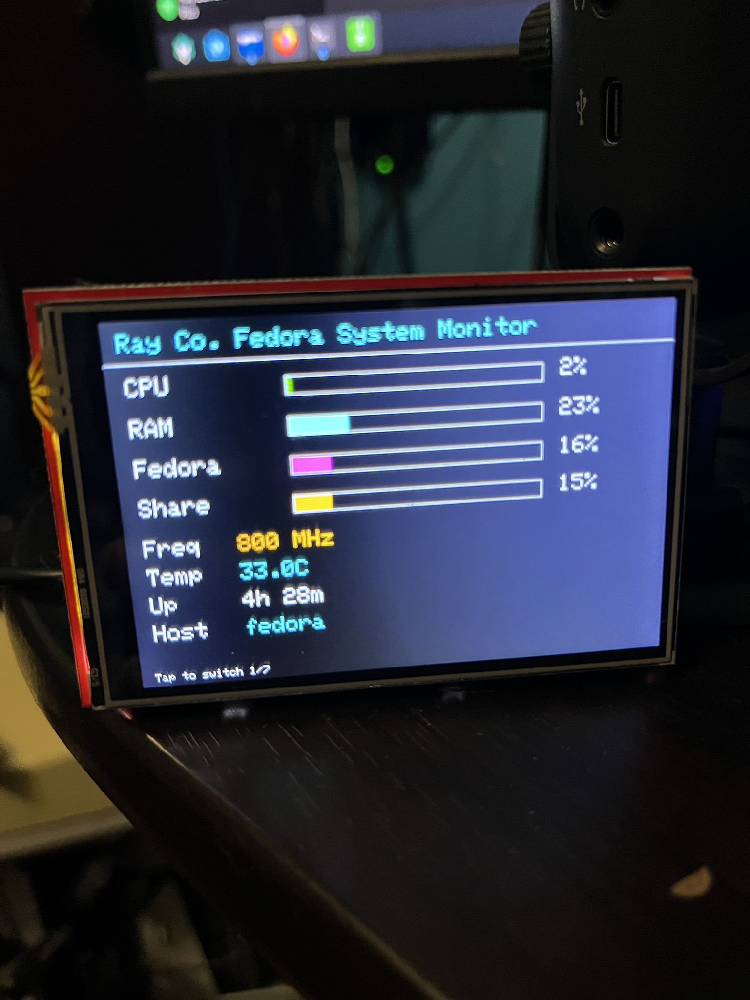
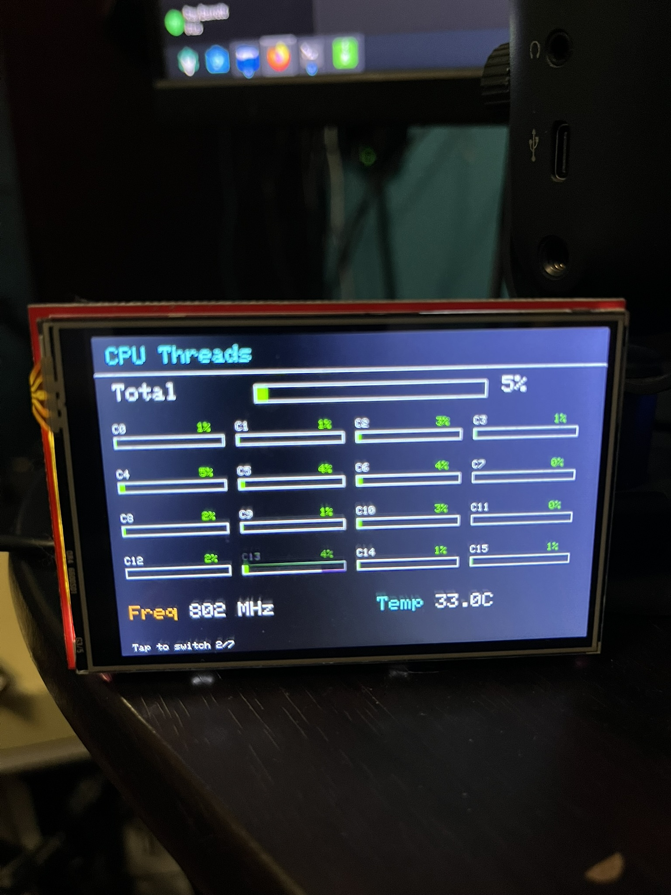
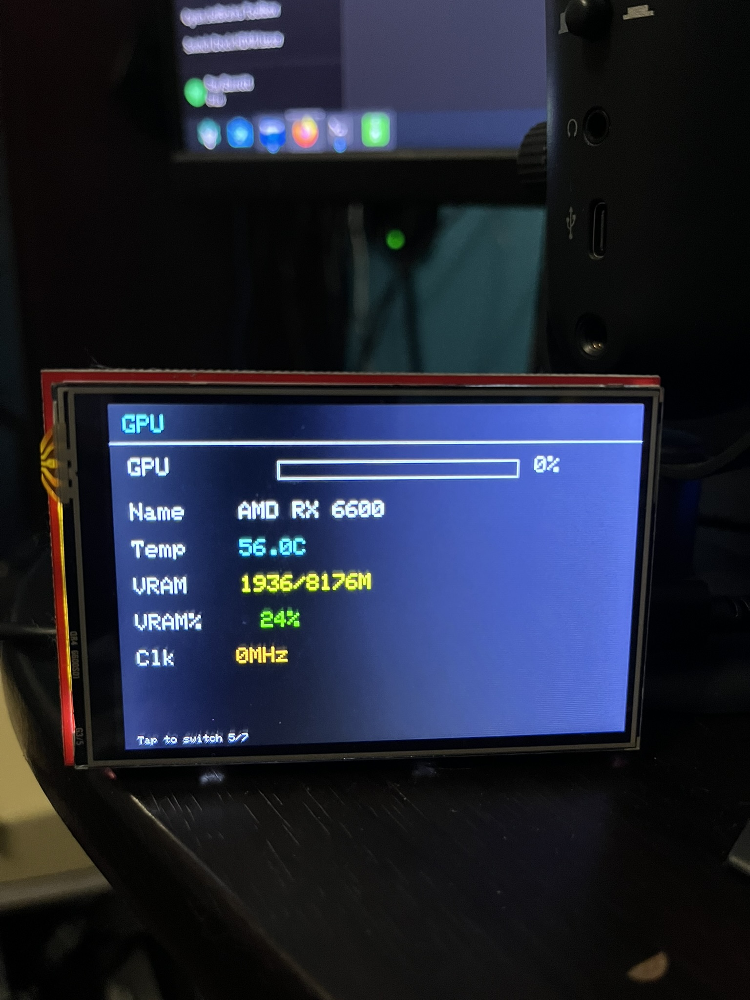
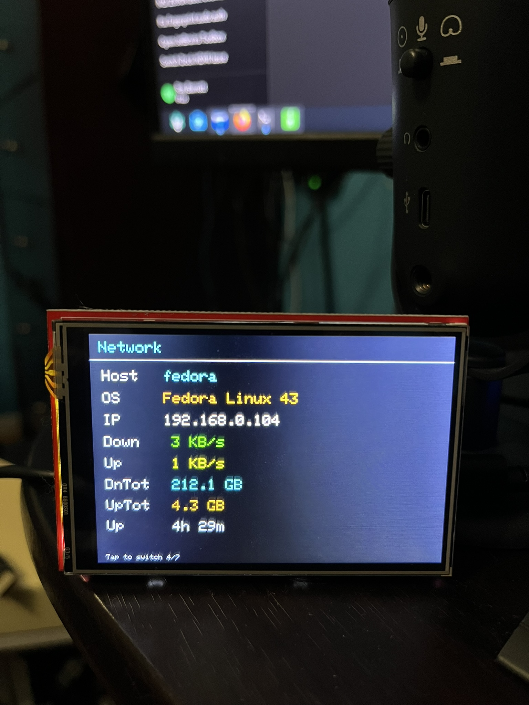
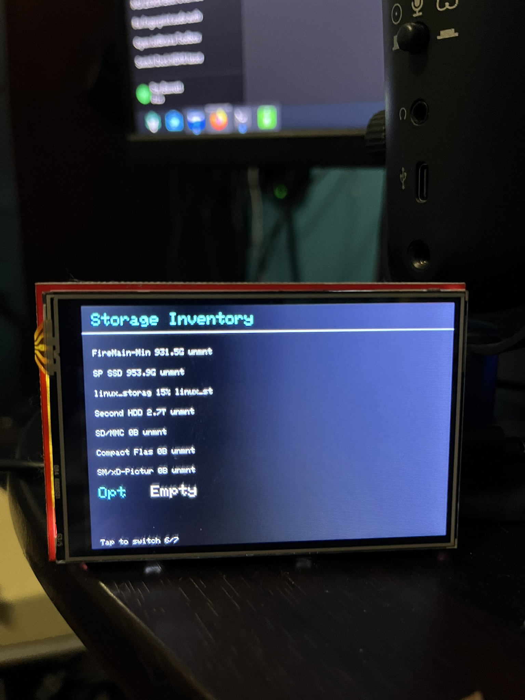
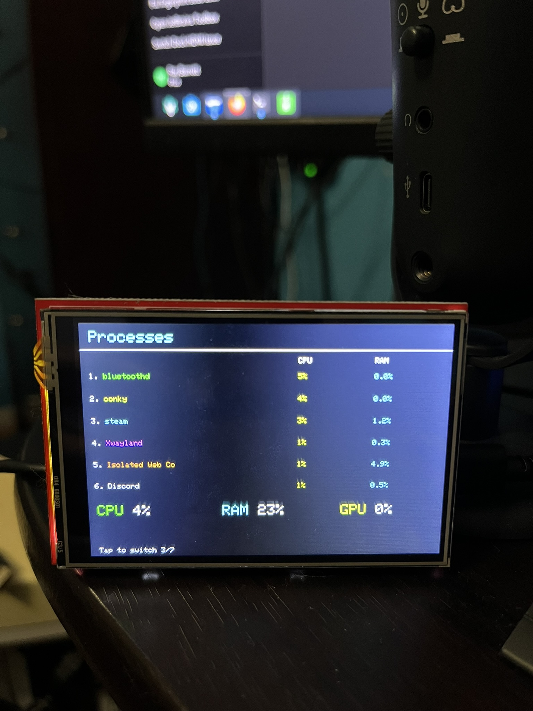
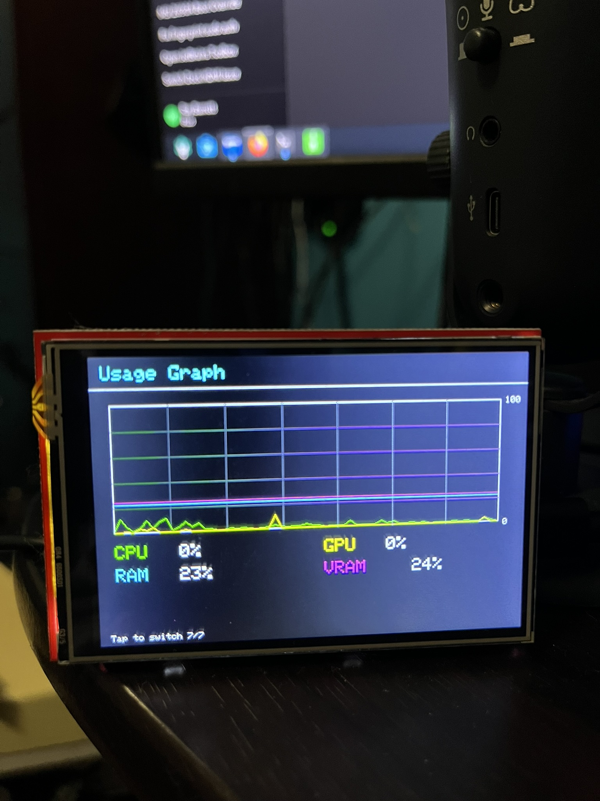

# Ray Co. Linux / Windows Arduino Desktop System Monitor

Displays real-time PC hardware statistics (CPU, RAM, GPU, disks, network, and processes) on an Arduino touchscreen using a Python monitoring script.

**Author:** Ray Barrett  
**Version:** 7.8  
**Last Modified:** March 17, 2026  

---

## Preview

### Main View
<p align="center">
  
</p>

### Other Pages
<p align="center">
  
  
  
  
  
  
</p>

---

## Important Notes

- This project is **developed and tested on Fedora (KDE 43)**.
- It is now designed to work across **most Linux distributions**.
- GPU detection supports:
  - NVIDIA (`nvidia-smi`)
  - AMD (DRM/sysfs)
  - Intel (DRM/sysfs / intel tools)
- Behavior may vary depending on drivers and system configuration.

## Project Structure

- Python Monitor (main system)
- Arduino Display (hardware UI)
- Java Fake Display (debug tool)
- Virtual serial (socat) for testing

---

## Requirements

- Python 3.8+
- Arduino IDE 1.8.19+
- **Option A:** Arduino UNO R4 (USB-C) + Arduino 3.5" TFT Display
- **Option B:** Arduino UNO R3 (USB-B) + 2.8" TFT UNO R3 Display

### Windows Only
- LibreHardwareMonitor

---

## Changelog

```text
4.0  - Initial
4.1  - Fixed README
4.2  - Enlarged text for OS and hostname, fixed Linux issues
4.3  - Fixed OS naming
4.4  - Faster polling and improved Windows logic
4.5  - Re-added uptime
5.0  - Major fixes, GPU page fully fixed
5.1  - Timing tuning for Windows 7 & 10
5.2  - Added R3 support
5.3  - Backup versions + README fixes
5.4  - Laptop support (no charging % yet)
5.5  - Dropped Windows XP support
6.0  - Stable release, Linux packages separated
7.0  - Added Fedora KDE 43 support
7.1  - Reorganized folder structure, separated Windows components
7.2  - Made Linux universal, GPU detection for NVIDIA/AMD/Intel, reduced Fedora-specific dependencies
7.3  - Added basic Java GUI debugger/emulator and config-driven debug output support for the Java fake display
7.4  - Added install.sh improvements, config auto-generation, standardized install path (~/ArduinoUniversalSystemMonitor), and update.sh support
7.5  - Re-added 2.8" TFT UNO R3 support, updated documentation, and clarified hardware requirements/options
7.6  - Added Arduino CLI flashing workflow, automatic board/core/library setup, and install_arduinos.sh support
7.7  - Added post-install Arduino flashing prompt, arduino_install.sh entrypoint, and updated install script documentation
7.8  - Fixed Installer for Ubuntu/Mint machines due to Python restrictions
```

---

## TODO

- Bundle Python, pip, and dependencies

---

## Confirmed Working Systems

- Windows 11 Pro  
- Windows 10 LTSC  
- Windows 7 Ultimate  
- Linux Mint 22.3  
- Fedora KDE 43  

---

# Installation

## Linux Setup (Automatic - Recommended)

First, make sure `git` is installed:

### Ubuntu / Linux Mint / Debian

```bash
sudo apt update
sudo apt install -y git
```

### Fedora

```bash
sudo dnf install -y git
```

### Arch

```bash
sudo pacman -Sy --noconfirm git
```

### Linux Automatic Install Snippet

```bash
git clone https://github.com/Firefoxray/ArduinoUniversalSystemMonitor.git
cd ArduinoUniversalSystemMonitor
chmod +x install.sh
./install.sh
```

or

```bash
git clone https://github.com/Firefoxray/ArduinoUniversalSystemMonitor.git && cd ArduinoUniversalSystemMonitor && chmod +x install.sh && ./install.sh
```

During `./install.sh`, the script installs system packages, Python dependencies, config/service files, and then prompts:

`Would you like to install and flash your Arduino(s) now? [y/N]:`

- Typing `y` runs `./arduino_install.sh` (which calls `install_arduinos.sh`).
- The Arduino installer ensures `arduino-cli` is installed, installs required board cores (`arduino:avr`, `arduino:renesas_uno`), installs required libraries/dependencies (`MCUFRIEND_kbv`, `Adafruit GFX Library`, `TouchScreen`), and flashes supported connected boards.
- The Linux installer/update scripts use a project virtual environment (`.venv`) so Ubuntu/Mint pip "externally managed environment" issues are avoided.
- Install flow order is: dependency setup -> Arduino flash prompt -> systemd service start.

A default `monitor_config.json` is automatically created during installation.

---

## Arduino Flashing Script (Standalone)

If you skip the prompt or want to reflash later:

```bash
cd ~/ArduinoUniversalSystemMonitor
chmod +x arduino_install.sh
./arduino_install.sh
```

---

## Linux Setup (Manual)

### Create Service

```bash
sudo nano /etc/systemd/system/arduino-monitor.service
```

```ini
[Unit]
Description=Arduino System Monitor
After=network.target

[Service]
ExecStart=/usr/bin/python3 /home/YOUR_USERNAME/ArduinoUniversalSystemMonitor/UniversalArduinoMonitor.py
WorkingDirectory=/home/YOUR_USERNAME/ArduinoUniversalSystemMonitor
Restart=always
User=YOUR_USERNAME

[Install]
WantedBy=multi-user.target
```

---

### Enable

```bash
sudo systemctl daemon-reload
sudo systemctl enable arduino-monitor
sudo systemctl start arduino-monitor
```

---

### Serial Permissions (IMPORTANT)

```bash
sudo usermod -aG dialout $USER
```

Log out and back in.

---
# Running the Program

## Linux

```bash
sudo systemctl start arduino-monitor
sudo systemctl stop arduino-monitor
sudo systemctl restart arduino-monitor
sudo systemctl status arduino-monitor
```
## Updating (Linux)

```
cd ~/ArduinoUniversalSystemMonitor
./update.sh
```

This will:

- Pull the latest version from GitHub

- Update Python dependencies

- Restart the system service

---

## Uninstall (Linux)

To completely remove the monitor, service, and installed files:

```bash
cd ~/ArduinoUniversalSystemMonitor
chmod +x uninstall_monitor.sh
./uninstall_monitor.sh
```

This will:

Stop and disable the systemd service

Remove the service file

Remove installed monitor files and directories

Clean up previous install locations

After uninstalling, you can reinstall cleanly using:

`./install.sh`

---

# Troubleshooting

### Check Arduino Port

```bash
ls /dev/ttyACM* /dev/ttyUSB*
```

---

### Detect Plug-In

```bash
dmesg -w
```

---

### Verify Permissions

```bash
ls -l /dev/ttyACM0
```

---

### Check Service

```bash
sudo systemctl status arduino-monitor
```

## Debug Tools

This repository also includes a Java-based Fake Arduino Display tool for testing the serial output without requiring a physical Arduino.

Location:
`debug_tools/FakeArduinoDisplay`

Use it with a virtual serial pair such as:
`/tmp/fakearduino_in` and `/tmp/fakearduino_out`

Debug mirror is configured from `monitor_config.json` and is disabled by default:

```json
{
  "debug_enabled": false,
  "debug_port": "/tmp/fakearduino_in"
}
```

The main `UniversalArduinoMonitor.py` still sends the original Arduino positional payload, and when debug mode is enabled it also emits the Java-compatible `KEY:VALUE` stream on `debug_port`.
